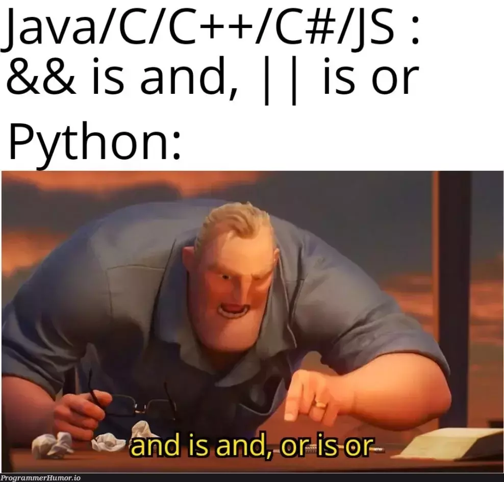

    

<h1 align="center">
    
    Hello there, I'm Justin!
    
</h1>

<h3 align="center">National University of Singapore, School of Computing, Year 3 Computer Science </h3>

<table align="center" style="table-layout: fixed; width: 100%;">
  <tr>
    <td align="center">
      
      <h2>Software Engineer 💻</h2>
    </td>
    <td align="center">
      
      <h2>Teaching Assistant 👨‍🏫</h2>
    </td>
    <td align="center">
      
      <h2>Tech Enthusiast 💡</h2>
    </td>
  </tr>
</table>

 

### 🧠 I’m currently learning HTML, CSS and JavaScript through  [The Odin Project](https://www.theodinproject.com/) and  [W3 Schools](https://www.w3schools.com/) 

     
    

### 💡 I teach ♾ Discrete Mathematics and 🐍 Python Programming Methodology

     
    

<h3>
    📫 Reach out to me at 

<u>justintanwk2001@gmail.com</u> or on 
<a href="https://www.linkedin.com/in/tan-wee-kian-justin/" target="blank">LinkedIn</a>

</h3> 

 

<table>
  <tr>
    <td valign="top" width="40%">
      <h3>Languages, Frameworks and Tools I've experimented with:</h3>
          <table align="center" width="100%">
      <tr>
        <td align="center"></td>
        <td align="center">Python</td>
        <td align="center"></td>
        <td align="center">Pandas</td>
        <td align="center"></td>
        <td align="center">NumPy</td>
      </tr>
      <tr>
        <td align="center"></td>
        <td align="center">scikit-learn</td>
        <td align="center"></td>
        <td align="center">PyTorch</td>
        <td align="center"></td>
        <td align="center">Matplotlib</td>
      </tr>
      <tr>
        <td align="center"></td>
        <td align="center">Java</td>
        <td align="center"></td>
        <td align="center">IntelliJ</td>  
        <td align="center"></td>
        <td align="center">JavaFX</td>
      </tr>
      <tr>
        <td align="center"></td>
        <td align="center">C</td>
        <td align="center"></td>
        <td align="center">C++</td>        
        <td align="center"></td>
        <td align="center">XML</td>
      </tr>
        <tr>
        <td align="center"></td>
        <td align="center">CSS</td>
        <td align="center"></td>
        <td align="center">HTML</td>
        <td align="center"></td>
        <td align="center">JavaScript</td>
      </tr>
      <tr>
        <td align="center"></td>
        <td align="center">Git</td>
        <td align="center"></td>
        <td align="center">Github</td>
        <td align="center"></td>
        <td align="center">Jupyter</td>
      </tr>
      <tr>
        <td align="center"></td>
        <td align="center">Flutter</td>
        <td align="center"></td>
        <td align="center">Dart</td>
        <td align="center"></td>
        <td align="center">Firebase</td>
      </tr>
    <tr>
        <td align="center"></td>
        <td align="center">Hugging Face</td>
        <td align="center"></td>
        <td align="center">React</td>
        <td align="center"></td>
        <td align="center">Brawl</td>
      </tr>
      <tr>
        <td align="center"></td>
        <td align="center">Neo4j</td>    
        <td align="center"></td>
        <td align="center">OpenAI</td>
        <td align="center"></td>
        <td align="center">Matlab</td>    
      </tr>
      <tr>
        <td align="center"></td>
        <td align="center">Microsoft Office</td>
        <td align="center"></td>
        <td align="center">Tableau</td>
        <td align="center"></td>
        <td align="center">Notion</td>     
      </tr>      
      <tr>
        <td align="center"></td>
        <td align="center">Figma</td>
        <td align="center"></td>
        <td align="center">Canva</td>
        <td align="center"></td>
        <td align="center">Photoshop</td>
      </tr>
      <tr>
        <td align="center"></td>
        <td align="center">Unix</td>
        <td align="center"></td>
        <td align="center">Bash</td>
        <td align="center"></td>
        <td align="center">Vim</td>
      </tr>         
      <tr>
        <td align="center"></td>
        <td align="center">Gradle</td>      
        <td align="center"></td>
        <td align="center">JSON</td>
        <td align="center"></td>
        <td align="center">Android Studio</td>
      </tr>         
    </table>
</td>
<td valign="top" width="60%">
  <h3>Statistical Data:</h3>
  
  
  
  
  <h3 align="center">
    Check out my <a href="https://github.com/jyztintan/Leetcode" style="color: #ffffff; text-decoration: none; font-size: 16px;">Leetcode Repo</a>
  </h3>
  
</td>

</tr>
</table>

  
     

