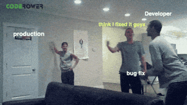

    

<h1 align="center">
    
    Hello there, I'm Justin!
    
</h1>

<h3 align="center">National University of Singapore, School of Computing, Final Year Computer Science</h3>

<table align="center" style="table-layout: fixed; width: 100%;">
  <tr>
    <td align="center">
      
      <h2>Software Engineer 💻</h2>
    </td>
    <td align="center">
      
      <h2>Teaching Assistant 👨‍🏫</h2>
    </td>
    <td align="center">
      
      <h2>Tech Enthusiast 💡</h2>
    </td>
  </tr>
</table>

 

### 👨‍💻 I’m currently a Software Engineer (Payment Network) Intern in ByteDance 

   

### 🧠 I’m currently learning System Design, Software Testing and Operating Systems

  
   
  

### 💡 I teach ♾ Discrete Mathematics and 🐍 Python Programming Methodology

     
    

### 🤓 I grind 🚀 LeetCode daily for fun   
<table>
    <tr>
    <td>
      
    </td>
    <td>
      
    </td>
    </tr>
  <tr>
    <td>
      
    </td>
    <td>
      
    </td>
  </tr>
</table>

### 💬 Languages, 🏗️ Frameworks, 🛠️ Tools

<table align="center">
  <tr>
    <td align="center" width="33%">
      
      
      
      
      
      
      
      
      
      
    </td>
    <td align="center" width="33%">
      
      
      
      
      
      
    </td>
    <td align="center" width="33%">
      
      
      
      
      
      
      
      
      
    </td>
  </tr>
</table>
                    
<h3> 📫 Reach out to me at 
    
    <u>justintanwk2001@gmail.com</u> or on 
    <a href="https://www.linkedin.com/in/tan-wee-kian-justin/" target="blank">LinkedIn</a>
    
</h3>

  
     

